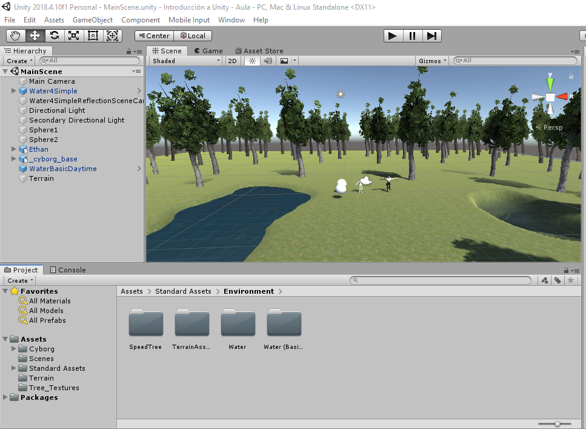
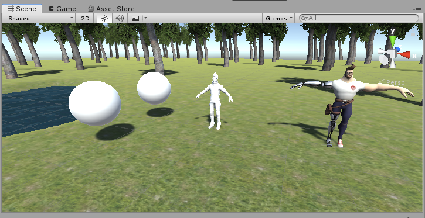
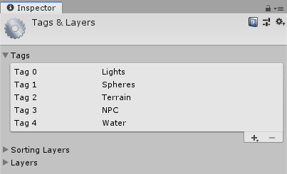
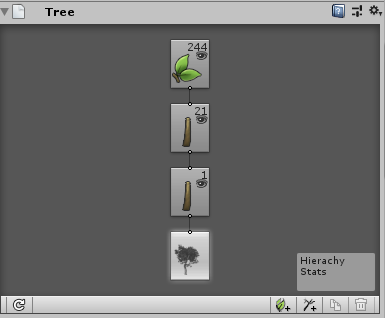
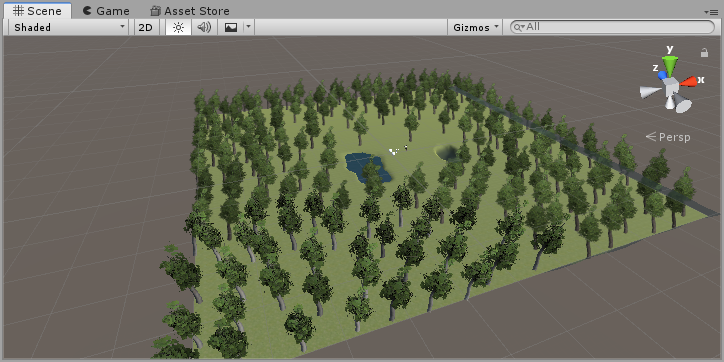
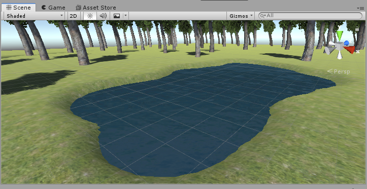
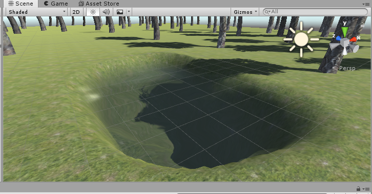

# Introducción a Unity - Aula

## Objetivos:
Realizar una escena 3D básica utilizando exclusivamente el editor de escenas. La escena debe configurarse de la siguiente manera:

* Incluir dos objetos 3D básicos, por ejemplo 2 esferas.
* Incluir un personaje com Ethan, de los Standard Assets.
* Incluir un personaje de la Asset Store.
* Crear un terreno.
* Cada objeto debe tener una etiqueta que lo identifique.
* La escena debe tener 2 fuentes de luz.
* Agregar agua y árboles en el terreno.

## Objetos

## Etiquetas

## Árbol

## Agua

